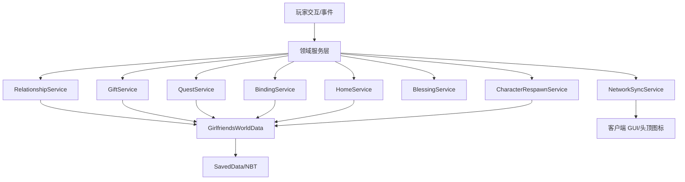

# 女友（Girlfriends）v0.1.0 底层系统技术设计

## 1. 文档概览

### 1.1 文档目的

本文档用于定义《女友（Girlfriends）》v0.1.0 中可先行实现的底层系统技术方案，包括好感度系统、礼物系统、委托系统、多人绑定系统、跟随祝福系统、家园系统、角色死亡重生系统、持久化模型、网络同步与接口边界。

本文档不展开具体角色 AI 行为、具体固定委托步骤、具体随机委托目标生成规则、角色对白、结构方块细节与终章奖励的最终数值，因为这些内容依赖后续 GDD。

### 1.2 设计目标

1. 将 PRD 中的核心玩法规则转化为稳定、可测试、可扩展的底层系统。
2. 让好感度、委托、绑定、家园、跟随祝福等系统可以在缺少完整 GDD 的情况下先行实现。
3. 为后续五位角色内容、GUI、AI 行为、结构生成与奖励系统提供清晰接口。
4. 确保多人服务器环境下的状态一致性、权限边界与长期存档安全。

### 1.3 技术背景

1. 项目为 Java 版 Minecraft NeoForge 模组。
2. 模组 ID 使用 `girlfriends`。
3. 主要逻辑运行在服务端，客户端仅负责展示、输入与本地表现。
4. 世界级长期状态使用 `SavedData` 持久化，玩家与角色实体状态通过 UUID 建立关联。
5. 核心纯规则逻辑应尽量脱离 Minecraft 对象，便于单元测试。

### 1.4 术语表

| 术语 | 定义 |
| --- | --- |
| `SavedData` | Minecraft 服务端世界级持久化机制，用于把模组状态写入存档并随世界加载恢复。 |
| `NBT` | Minecraft 原生数据序列化格式，适合保存实体、方块实体与世界级模组数据。 |
| `GlobalPos` | 由维度 ID 与方块坐标组成的位置描述，用于跨维度保存床、庇护所、死亡点等位置。 |
| 角色本体 | 同一世界中每位可攻略角色唯一存在的实体实例。 |
| 临时庇护所 | 角色主题结构，承担首次发现、重生锚点、环境展示与部分委托目标承载职责。 |
| 好感度 | 玩家对单个角色的独立关系数值，内部范围为 0 到 1000，客户端仅展示模糊进度。 |
| 好感阶段 | 根据好感度与关键确认状态推导出的关系阶段，包括陌生、熟悉、信赖、爱慕、亲密与家园同居。 |
| 亲密确认 | 玩家达到 700 好感后，通过专属固定委托或关键交互显式确认关系的状态。 |
| 家园同居 | 玩家完成家园前置并通过双人床绑定一名家园伙伴后的长期生活关系状态。 |
| 委托槽 | 每个角色同一时间唯一可发布的委托位置，固定委托与随机委托互斥占用。 |
| 固定委托 | 角色主线委托，接取后不过期，承担故事推进、关系确认与终章奖励发放职责。 |
| 随机委托 | 日常循环委托，按阶段解锁并在 5 到 10 个游戏日内过期。 |
| 爱慕绑定 | 玩家达到爱慕阶段后角色与该玩家建立的竞争绑定状态，会限制其他玩家继续快速推进。 |
| 动摇期 | 其他玩家好感超过当前绑定玩家后触发的 3 个游戏日宽限期。 |
| 亲密锁定 | 玩家完成亲密确认后角色进入的排他攻略状态，其他玩家无法继续推进该角色。 |
| 祝福 | 角色跟随玩家时提供的主题玩法增益，例如钓鱼双倍收益、矿物额外掉落或近战增伤。 |
| 服务端权威 | 所有关系、奖励、委托、家园与祝福判定以服务端状态为准，客户端只负责展示和请求。 |

## 2. 总体架构

### 2.1 分层结构

底层系统划分为四层：

1. 领域模型层：定义角色、玩家关系、委托、礼物、家园、绑定、死亡重生等核心数据结构。
2. 领域服务层：封装好感变化、礼物结算、委托刷新、绑定转移、家园收益、祝福判定等规则。
3. Minecraft 集成层：负责事件监听、实体交互、Tick 驱动、结构发现、死亡事件、网络包与 GUI 打开。
4. 表现层：负责交互界面、头顶图标、聊天栏反馈、粒子音效等客户端表现。

### 2.2 推荐包结构

```text
src/main/java/com/hexagram2021/girlfriends/
	common/
		character/
			type/
			data/
			event/
		relationship/
			data/
			service/
		gift/
			data/
			service/
		quest/
			data/
			service/
		binding/
			data/
			service/
		home/
			data/
			service/
		blessing/
			service/
		death/
			service/
		network/
			clientbound/
			serverbound/
		persist/
			data/
			serializer/
	client/
		gui/
		render/
		tooltip/
```

该结构仅描述目标职责边界，具体实现时可以根据已有模板微调，但不建议将全部系统堆叠到单个 manager 类中。

### 2.3 核心组件关系



## 3. 领域标识与基础类型

### 3.1 角色标识

角色使用稳定字符串 ID，不直接依赖本地化名称。

| 角色 | ID | 维度限制 | 主生成环境 |
| --- | --- | --- | --- |
| 沫沫 | `momo` | 主世界 | 繁华森林 |
| 渔溪 | `yuxi` | 主世界 | 沙滩 |
| 梅疏 | `meishu` | 主世界 | 尖峭山峰 |
| 晚萤 | `wanying` | 下界 | 下界庇护所 |
| 幽若 | `youruo` | 末地 | 末地庇护所 |

`GirlfriendType` 必须定义为可注册的数据类，并通过 NeoForge 自定义注册表注册，禁止使用 enum。该自定义注册表必须在 `NewRegistryEvent` 中创建，内置角色再通过 `DeferredRegister` 注册到该注册表。

选择注册表形式的原因：

1. 附属模组可以通过注册表新增角色类型，不需要 mixin 修改本模组枚举。
2. 存档中只持久化 `ResourceLocation` 类型 ID，不依赖 Java enum 名称或 ordinal。
3. 角色类型可以携带维度策略、祝福类型、庇护所结构 key 等元数据，并允许后续数据驱动或注册扩展。

`GirlfriendType` 至少包含：

1. `descriptionId`：本地化描述 key。
2. `dimensionPolicy`：允许生成与重生的维度策略。
3. `favoriteGiftItem`：最喜好物品 ID，用于首个默认最喜好物品。
4. `blessingTypeId`：祝福类型 ID，指向可注册的 `BlessingType`。
5. `shelterStructureKey`：庇护所结构 key。

内置角色 ID 由 `GirlfriendTypes` 提供，例如 `girlfriends:momo`、`girlfriends:yuxi`、`girlfriends:meishu`、`girlfriends:wanying`、`girlfriends:youruo`。

`BlessingType` 同样必须定义为可注册的数据类，并通过 NeoForge 自定义注册表注册，禁止使用 enum。角色类型通过 `blessingTypeId` 引用祝福类型，附属模组可以注册新的祝福类型和对应处理器，不需要 mixin 修改本模组祝福枚举。

### 3.2 好感阶段

好感阶段由数值实时计算，不应重复持久化。

| 阶段 | ID | 最小值 | 最大值 |
| --- | --- | --- | --- |
| 陌生 | `stranger` | 0 | 99 |
| 熟悉 | `familiar` | 100 | 199 |
| 信赖 | `trust` | 200 | 499 |
| 爱慕 | `affection` | 500 | 699 |
| 亲密 | `intimate` | 700 | 899 |
| 家园同居 | `home_partner` | 900 | 1000 |

阶段边界以左闭右闭的整数区间实现，所有好感变化后统一裁剪到 0 到 1000。

### 3.3 委托类型

委托类型分为：

1. `FIXED`：固定委托，承担主线推进，不过期。
2. `RANDOM`：随机委托，承担日常循环，可过期。

委托状态分为：

1. `AVAILABLE`：角色当前发布但尚未被接取。
2. `ACCEPTED`：已被某位玩家接取。
3. `COMPLETED`：已完成并结算。
4. `EXPIRED`：随机委托过期。

底层系统只关心状态流转，不关心具体任务目标表现。

## 4. 持久化设计

### 4.1 总体策略

所有跨世界长期保留的核心状态统一存入世界级 `SavedData`，命名建议为 `girlfriends_world_data`。

使用世界级数据而非玩家 Capability 的原因：

1. 角色本体唯一性、庇护所发现、绑定动摇期、委托槽等状态天然属于世界。
2. 多人竞争规则需要同时比较多个玩家对同一角色的关系状态。
3. 角色死亡会清空所有玩家对该角色的关系、委托与家园状态，世界级数据更容易执行原子重置。

### 4.2 数据版本

根 NBT 必须包含：

```text
data_version: int
characters: compound
player_relations: compound
homes: compound
```

`data_version` 初始为 1，后续每次持久化格式发生不兼容变化时递增，并通过迁移器完成旧格式升级。

### 4.3 世界数据结构

#### 4.3.1 CharacterWorldState

每个角色一份世界状态。

| 字段 | 类型 | 说明 |
| --- | --- | --- |
| `character_id` | string | 角色 ID |
| `entity_uuid` | uuid nullable | 当前本体实体 UUID |
| `alive` | boolean | 当前是否存活 |
| `pending_respawn` | boolean | 是否等待庇护所生成后重生 |
| `death_pos` | GlobalPos nullable | 最近死亡位置 |
| `current_quest` | QuestInstance nullable | 当前唯一委托槽 |
| `binding` | CharacterBindingState | 多人绑定状态 |
| `discovered_shelters` | list ShelterRecord | 已生成或已发现庇护所 |

#### 4.3.2 PlayerCharacterRelation

每位玩家对每位角色一份关系状态。

| 字段 | 类型 | 说明 |
| --- | --- | --- |
| `player_uuid` | uuid | 玩家 UUID |
| `character_id` | string | 角色 ID |
| `affection` | int | 好感度，范围 0 到 1000 |
| `confirmed_intimacy` | boolean | 是否已通过亲密确认 |
| `completed_fixed_quests` | int set | 已完成固定委托序号 |
| `claimed_final_reward` | boolean | 是否已领取终章功能奖励 |
| `daily_gift_gain` | int | 当日礼物正向收益累计 |
| `daily_home_gain_claimed` | boolean | 当日家园好感是否已触发 |
| `daily_conflict_triggered` | boolean | 当日家园争执是否已触发 |
| `known_gift_preferences` | string set | 已揭示的礼物偏好记录 |
| `last_daily_reset_day` | long | 上次每日计数重置的游戏日 |

`confirmed_intimacy` 必须独立于好感值存在，因为 PRD 要求达到 700 后不能自动进入亲密关系。

#### 4.3.3 HomeState

每位玩家最多一份家园绑定状态。

| 字段 | 类型 | 说明 |
| --- | --- | --- |
| `player_uuid` | uuid | 玩家 UUID |
| `character_id` | string nullable | 当前家园伙伴 |
| `bed_pos` | GlobalPos nullable | 绑定双人床位置 |
| `active` | boolean | 家园绑定是否有效 |

#### 4.3.4 CharacterBindingState

每位角色一份多人绑定状态。

| 字段 | 类型 | 说明 |
| --- | --- | --- |
| `bound_player_uuid` | uuid nullable | 当前绑定玩家 |
| `locked_by_intimacy` | boolean | 是否因亲密关系锁定 |
| `challenger_player_uuid` | uuid nullable | 动摇期挑战者 |
| `wavering_start_day` | long | 动摇期开始游戏日 |
| `warned_bound_player` | boolean | 是否已向原绑定玩家预警 |

### 4.4 序列化约定

1. NBT key 使用小写蛇形并带 `girlfriends` 前缀或位于 `girlfriends_world_data` 根节点下。
2. UUID 使用 Minecraft 原生 UUID 存储方法，不转换为不透明字符串。
3. 维度与方块坐标使用 `GlobalPos` 等价结构保存。
4. 读取异常或缺字段时只对可安全恢复的字段使用默认值，关键数据损坏应记录 `WARN`。
5. 所有数据读写方法应有单元测试覆盖。

## 5. 好感度系统设计

### 5.1 职责

`RelationshipService` 负责：

1. 查询玩家与角色的好感数值与阶段。
2. 应用好感变化并裁剪范围。
3. 判断固定委托、随机委托、赠礼、跟随、家园邀请等功能是否解锁。
4. 处理每日计数重置。
5. 在角色死亡时批量清空对应角色的所有关系状态。

### 5.2 好感变化入口

好感变化只能通过统一服务入口执行，禁止各系统直接修改字段。

建议入口：

```text
changeAffection(playerUuid, characterId, source, rawDelta)
```

`source` 用于记录来源，包括：

1. `GIFT`
2. `FIXED_QUEST`
3. `RANDOM_QUEST`
4. `HOME_DAILY`
5. `HOME_CONFLICT`
6. `PLAYER_ATTACK`
7. `CHARACTER_DEATH_RESET`

### 5.3 阶段判定规则

阶段由当前好感和亲密确认标记共同决定：

1. 数值低于 700 时按数值区间返回阶段。
2. 数值达到 700 但未完成亲密确认时，玩法权限仍按爱慕后期处理，不开放跟随祝福与亲密锁定。
3. 数值达到 700 且完成亲密确认后，返回亲密阶段。
4. 数值达到 900 且完成家园前置固定委托后，允许邀请入住，但只有家园绑定成功后才进入家园同居状态。

### 5.4 下降与清零

1. 厌恶礼物按礼物公式产生负向变化。
2. 玩家攻击或误伤角色由事件层触发固定扣减，具体扣减值先配置化，默认建议为 10。
3. 家园争执扣减当前家园伙伴与来访角色各 3 到 5 点。
4. 角色死亡调用角色级重置，清空所有玩家对该角色的好感、绑定、委托、家园状态。
5. 已经发放给玩家的终章奖励不回收。

## 6. 礼物系统设计

### 6.1 职责

`GiftService` 负责：

1. 判定玩家手持物品对指定角色的礼物档位。
2. 计算单次赠礼实际好感变化。
3. 扣除物品并结算好感。
4. 更新每日礼物收益计数。
5. 揭示礼物偏好记录并同步到客户端。
6. 在绑定或亲密锁定场景下拒绝其他玩家赠礼。

### 6.2 礼物档位

礼物档位包括：

1. `FAVORITE`：最喜好，基础变化 +5。
2. `LIKED`：喜好，基础变化 +4。
3. `ACCEPTED`：普通接受，基础变化 +2。
4. `DISLIKED`：厌恶，基础变化 -2。
5. `REJECTED`：拒绝，不改变好感，不消耗物品。

`REJECTED` 不属于 PRD 中的偏好档位，而是系统状态档位，用于每日收益耗尽、绑定限制、不可赠送物品等场景。

### 6.3 每日收益与公式

PRD 中 6.4.2 写明每日礼物增长最多 15 点，10.1 表格写明 16 点。底层系统采用公式中的 16 作为计算分母，同时将每日正向累计上限配置为 15，避免第 16 点边界造成 UI 误解。

单次赠礼实际变化：

```text
actual_delta = base_delta * sqrt((16 - daily_positive_gain) / 16)
```

实现规则：

1. `daily_positive_gain` 只累计正向礼物收益，不累计负向厌恶礼物。
2. 当 `daily_positive_gain >= 15` 且本次礼物为正向档位时，拒绝收礼并提示。
3. 正向结果向下取整但至少为 1，避免玩家送喜好礼却没有任何反馈。
4. 负向结果向零取整但最多仍至少扣 1，避免厌恶礼物完全无惩罚。
5. 结算后正向累计不能超过 15。

### 6.4 礼物偏好数据来源

底层系统先支持数据驱动配置，具体物品列表由后续内容文档补齐。

礼物偏好由 `GiftPreferenceManager` 加载，该 Manager 继承 `SimplePreparableReloadListener`，从数据包路径 `data/<namespace>/girlfriends/gift_preferences/<path>.json` 读取配置。文件位置映射为角色类型 ID，例如 `data/girlfriends/girlfriends/gift_preferences/momo.json` 对应 `girlfriends:momo`。

推荐 JSON 数据结构（`momo.json`）：

```json
{
	"favorite": ["minecraft:honeycomb"],
	"liked_tags": ["minecraft:flowers"],
	"liked_items": ["minecraft:honey_bottle"],
	"accepted_tags": [],
	"accepted_items": [],
	"disliked_tags": [],
	"disliked_items": ["minecraft:rotten_flesh"]
}
```

未命中的物品默认视为 `REJECTED`，不建议默认为普通接受，否则会导致任意垃圾物品都能刷好感。

## 7. 委托系统设计

### 7.1 职责

`QuestService` 负责：

1. 管理每个角色唯一委托槽。
2. 判断固定委托是否可发布。
3. 刷新随机委托。
4. 接取、完成、过期委托。
5. 结算奖励、好感与固定委托完成记录。
6. 为头顶图标和 GUI 提供当前委托摘要。

### 7.2 委托实例

`QuestInstance` 建议包含：

| 字段 | 类型 | 说明 |
| --- | --- | --- |
| `quest_instance_id` | uuid | 委托实例 ID |
| `character_id` | string | 发布角色 |
| `quest_type` | enum | 固定或随机 |
| `quest_id` | string | 委托定义 ID |
| `fixed_index` | int nullable | 固定委托序号，1 到 10 |
| `required_stage` | enum | 要求阶段 |
| `owner_player_uuid` | uuid nullable | 接取者 |
| `state` | enum | 当前状态 |
| `created_day` | long | 创建游戏日 |
| `expire_day` | long nullable | 随机委托过期游戏日 |
| `progress` | compound | 目标进度，由具体目标处理器解释 |

### 7.3 固定委托发布规则

固定委托是否可发布由以下条件决定：

1. 当前角色委托槽为空。
2. 玩家是当前角色固定委托允许接取者。
3. 玩家好感阶段达到该固定委托要求。
4. 前置固定委托已完成。
5. 当前固定委托未被该玩家完成。
6. 角色未被其他玩家的爱慕绑定或亲密锁定排除。

固定委托只允许一名玩家接取与完成，但其他玩家可以协助完成目标。

### 7.4 随机委托刷新规则

随机委托由服务端世界 Tick 驱动，每个角色独立计算。

1. 每个角色同一时间最多一个委托槽。
2. 角色存在未完成委托时不刷新新委托。
3. 随机委托创建时随机选择 5 到 10 个游戏日后的过期日。
4. 过期时将状态置为 `EXPIRED` 并清空角色委托槽。
5. 亲密锁定后，随机委托仅向亲密玩家可见或可接取。
6. 固定委托可发布时优先级高于随机委托，避免主线推进被日常委托长期占位。

### 7.5 委托目标接口

由于具体 GDD 尚未完成，底层系统只定义目标接口。

```text
QuestObjectiveHandler
	canAccept(context)
	onAccept(context)
	onEvent(context, event)
	isCompleted(context)
	serializeProgress(progress)
	deserializeProgress(tag)
```

委托目标采用组合模型，不采用继承链模拟“多继承”。一个委托可以同时持有多个 `QuestObjectiveHandler`，例如交付物品、到达结构、在指定方块附近停留超过一段时间。`QuestObjectiveGroup` 负责聚合多个目标，默认要求全部目标完成后委托才完成。

首期可以先实现通用目标类型：

1. 交付物品目标。
2. 击杀实体目标。
3. 到达位置或结构目标。
4. 陪伴计时目标。
5. 指定方块附近停留目标。
6. 方块交互目标。

接取委托时必须对 `owner_player_uuid` 做原子校验：只有当前 owner 为空时才能写入接取者；若 owner 已经是其他玩家，则拒绝接取；若 owner 已经是当前玩家，则幂等返回成功。完成委托时必须再次校验完成者等于 owner，协助者可以贡献目标进度但不能领取奖励或推进关系。

具体角色固定委托可先以数据占位形式定义，待 GDD 补齐后填充目标参数。

## 8. 多人绑定与竞争系统设计

### 8.1 职责

`BindingService` 负责：

1. 在玩家达到爱慕阶段时建立或更新角色绑定。
2. 限制其他玩家固定委托与礼物入口。
3. 检测其他玩家好感超过当前绑定玩家后的动摇期。
4. 处理 3 个游戏日宽限期后的绑定转移。
5. 在亲密确认后锁定角色，阻止其他玩家继续攻略。

### 8.2 绑定建立

当玩家对角色达到 500 点且角色没有绑定玩家时：

1. 将 `bound_player_uuid` 设置为该玩家。
2. 不清空其他玩家已有好感。
3. 从此刻起，角色不再向其他玩家发布固定委托，也不再接受其他玩家礼物。

### 8.3 动摇期

当未绑定玩家的好感超过当前绑定玩家时：

1. 若未处于动摇期，记录挑战者与开始游戏日。
2. 向原绑定玩家发送一次预警。
3. 3 个游戏日后重新比较。
4. 若挑战者仍领先，绑定转移到挑战者。
5. 若挑战者不再领先，清除动摇期。

若动摇期内出现新的更高好感挑战者，更新挑战者并重置动摇期开始日。

### 8.4 亲密锁定

当某玩家完成亲密确认固定委托后：

1. 设置 `locked_by_intimacy = true`。
2. 绑定玩家必须为亲密确认玩家。
3. 角色不再向其他玩家发布固定委托或随机委托。
4. 其他玩家无法继续通过礼物或委托提升该角色好感。
5. 不清空其他玩家历史好感与已完成固定委托记录。

## 9. 跟随与祝福系统设计

### 9.1 职责

`BlessingService` 负责：

1. 判断玩家是否拥有某角色祝福。
2. 在原版事件中应用祝福效果。
3. 保持祝福逻辑与角色 AI 跟随逻辑解耦。
4. 防止重复叠加、跨维度错误生效与客户端伪造。

### 9.2 祝福启用条件

祝福生效必须同时满足：

1. 玩家与角色已完成亲密确认。
2. 角色当前处于跟随该玩家状态。
3. 玩家与角色处于同一维度。
4. 角色存活且实体有效。
5. 角色与玩家距离未超过配置阈值，默认 32 格。

### 9.3 固定祝福接入点

| 角色 | 效果 | 推荐接入点 |
| --- | --- | --- |
| 渔溪 | 划船速度 +50% | 船实体 Tick 或玩家控制输入事件 |
| 渔溪 | 钓鱼 25% 双倍收益 | 钓鱼战利品生成事件 |
| 梅疏 | 挖矿 25% 额外掉落 | 方块掉落事件，限定矿石标签 |
| 沫沫 | 不吸引指定动物仇恨 | 实体目标选择事件 |
| 晚萤 | 近战伤害 +40% | 玩家近战伤害事件 |
| 晚萤 | 受到伤害 -25% | 玩家受伤事件 |
| 幽若 | 末影珍珠 25% 不消耗 | 物品使用事件 |

所有概率判定必须在服务端执行，客户端仅展示结果。

### 9.4 跟随行为边界

底层系统只提供跟随状态与权限，不实现复杂 AI 行为。

推荐状态：

1. `STAY`：停留。
2. `FOLLOW`：跟随。
3. `HOME`：家园活动。

具体移动、短距离采集、战斗支援等由后续 AI 行为设计实现。

## 10. 家园系统设计

### 10.1 职责

`HomeService` 负责：

1. 判断玩家是否可邀请角色入住。
2. 绑定双人床与家园伙伴。
3. 解除或更换家园伙伴。
4. 触发家园回血与每日好感收益。
5. 检测家园争执事件。

### 10.2 入住条件

玩家邀请角色入住必须满足：

1. 好感度达到 900。
2. 已完成该角色第 10 条固定委托。
3. 角色已完成亲密确认。
4. 玩家当前没有其他活跃家园伙伴。
5. 目标床为合法双人床绑定点。
6. 角色与玩家处于同一维度且距离满足交互范围。

若玩家已有家园伙伴，必须先显式解除绑定。

### 10.3 双人床绑定

Minecraft 原版没有双人床概念，底层系统将双人床定义为两个相邻床方块形成的结构。

判定规则：

1. 两个床方块必须相邻。
2. 两个床方块朝向一致。
3. 两个床方块都属于同一维度。
4. 绑定时记录其中一个床头坐标作为锚点，并在运行时重新校验结构是否仍存在。

若床结构被破坏，家园状态暂时失效但不自动解除，玩家可修复床后恢复。

### 10.4 家园收益

每 10 秒服务端检查一次：

1. 玩家与家园伙伴都在绑定床 20 格内时，玩家恢复 1 点生命值。
2. 玩家生命值已满时不产生治疗事件。
3. 每游戏日最多为该玩家与该角色增加 2 点好感。
4. 每日好感收益使用 `daily_home_gain_claimed` 防重。

### 10.5 家园争执

触发条件：

1. 玩家已有当前家园伙伴。
2. 玩家与另一名已亲密确认角色进入绑定床 20 格范围内。
3. 当前家园伙伴也在绑定床 20 格范围内。
4. 玩家当日未触发过家园争执。

触发效果：

1. 当前家园伙伴对玩家扣除 3 到 5 点好感。
2. 来访角色对玩家扣除 3 到 5 点好感。
3. 发送短聊天栏文本。
4. 设置当日争执已触发。

## 11. 角色死亡与重生系统设计

### 11.1 职责

`CharacterRespawnService` 负责：

1. 响应角色死亡事件。
2. 清空该角色相关世界状态与玩家关系状态。
3. 保留玩家已获得的终章奖励资产。
4. 选择最近的可用庇护所重生。
5. 在没有可用庇护所时标记待重生。

### 11.2 死亡处理流程

角色死亡后按顺序执行：

1. 记录死亡维度与位置。
2. 清空该角色当前委托槽。
3. 清空该角色绑定状态。
4. 清空所有玩家对该角色的好感、委托进度、礼物每日状态、亲密确认与家园关系。
5. 解除所有以该角色为家园伙伴的 HomeState。
6. 将角色世界状态标记为死亡。
7. 尝试查找最近的同角色、同维度策略允许的已生成庇护所。
8. 找到则生成新本体，找不到则设置 `pending_respawn = true`。

### 11.3 庇护所记录

`ShelterRecord` 建议包含：

| 字段 | 类型 | 说明 |
| --- | --- | --- |
| `character_id` | string | 对应角色 |
| `dimension` | ResourceKey | 维度 |
| `pos` | BlockPos | 庇护所锚点 |
| `generated_day` | long | 生成游戏日 |
| `available_for_respawn` | boolean | 是否可用于重生 |

当后续探索生成庇护所时，若对应角色处于待重生状态，应立即尝试重生。

## 12. 网络同步与 GUI 边界

### 12.1 同步原则

1. 服务端为所有规则状态的唯一可信来源。
2. 客户端只接收当前玩家可见的关系摘要、委托摘要、偏好记录与交互按钮可用性。
3. 客户端不得提交好感值、委托完成状态、奖励结果等可信状态。
4. 所有 Serverbound 网络包必须重新校验玩家、角色实体、距离、权限、物品与状态。

### 12.2 推荐网络包

| 方向 | 包名 | 作用 |
| --- | --- | --- |
| S2C | `ClientboundSyncInteractionDataPacket` | 同步交互界面所需摘要 |
| S2C | `ClientboundQuestIconPacket` | 同步角色头顶委托图标状态 |
| S2C | `ClientboundRelationshipToastPacket` | 同步关键关系变化提示 |
| C2S | `ServerboundOpenInteractionGuiPacket` | 请求打开角色交互界面 |
| C2S | `ServerboundGiveGiftPacket` | 请求赠礼 |
| C2S | `ServerboundAcceptQuestPacket` | 请求接取委托 |
| C2S | `ServerboundCompleteQuestPacket` | 请求完成委托 |
| C2S | `ServerboundSetFollowModePacket` | 请求跟随或停留 |
| C2S | `ServerboundInviteHomePacket` | 请求家园邀请 |
| C2S | `ServerboundReleaseHomePartnerPacket` | 请求解除家园绑定 |

### 12.3 GUI 数据模型

交互界面只需要展示摘要：

1. 角色显示名与头像。
2. 模糊好感进度条与阶段名称。
3. 当前委托类型、名称、状态与按钮可用性。
4. 当前委托内容摘要，包括标题 key、描述 key 与目标摘要 key 列表，不同步完整进度 NBT。
5. 赠礼入口状态。
6. 跟随、停留、家园邀请按钮状态。
7. 已知偏好摘要，仅包含该玩家已经揭示的物品或标签及其档位。

模糊好感进度条不显示具体数值，只显示当前阶段内进度比例。

## 13. 事件与 Tick 设计

### 13.1 事件入口

| 事件 | 系统 | 说明 |
| --- | --- | --- |
| 玩家登录 | 同步 | 同步相关角色摘要与家园状态 |
| 玩家右键角色 | GUI | 打开交互界面 |
| 玩家攻击角色 | 好感 | 扣减好感 |
| 角色死亡 | 死亡重生 | 清空关系并尝试重生 |
| 玩家使用物品 | 礼物/幽若祝福 | 赠礼或末影珍珠不消耗 |
| 方块掉落 | 梅疏祝福 | 矿物额外掉落 |
| 实体受伤 | 晚萤祝福 | 伤害增减 |
| 战利品生成 | 渔溪祝福 | 钓鱼双倍收益 |
| 实体目标选择 | 沫沫祝福 | 阻止指定动物仇恨 |

### 13.2 Tick 频率

1. 每 20 tick：处理轻量跟随状态校验与 GUI 必要同步节流。
2. 每 200 tick：处理家园回血与家园好感收益。
3. 每游戏日变化时：重置每日礼物、家园、争执状态，检查随机委托刷新与过期，检查绑定动摇期。

不得在每 tick 全量扫描所有玩家与所有角色的复杂状态，应按角色与在线玩家建立小范围检查。

## 14. 数据驱动设计

### 14.1 适合数据驱动的内容

1. 礼物偏好。
2. 固定委托元数据。
3. 随机委托模板元数据。
4. 祝福数值与行为参数。
5. 好感变化数值。
6. 家园收益数值。
7. 聊天栏短文本。

每类 JSON 数据都应由独立 Manager 加载，Manager 继承 `SimplePreparableReloadListener`，在 prepare 阶段解析 JSON，在 apply 阶段一次性替换为不可变数据快照。建议首期至少包含 `GiftPreferenceManager`、`FixedQuestDefinitionManager`、`RandomQuestTemplateManager` 与 `BlessingParameterManager`。

### 14.2 不建议数据驱动的内容

1. 关键权限规则。
2. 多人绑定转移流程。
3. 角色死亡清零流程。
4. 网络包安全校验。
5. SavedData 迁移逻辑。

这些内容应通过代码固定实现，并通过测试保障一致性。

## 15. 接口边界

### 15.1 与角色实体系统的边界

底层系统需要角色实体提供：

1. 当前角色 ID。
2. 当前实体 UUID。
3. 是否存活。
4. 跟随目标玩家 UUID。
5. 当前行为模式。

底层系统不直接决定复杂 AI 路径、动画、日程和具体采集动作。

### 15.2 与结构生成系统的边界

结构系统需要在庇护所生成成功后调用：

```text
registerShelter(characterId, dimension, pos)
```

死亡重生系统通过已注册庇护所寻找重生点，不直接扫描世界结构。

### 15.3 与奖励系统的边界

委托系统只发出奖励结算请求：

```text
grantQuestReward(player, characterId, questId, rewardType)
```

终章奖励需要检查 `claimed_final_reward`，确保每位玩家对每位角色只领取一次。

### 15.4 与 GUI 系统的边界

GUI 只使用只读摘要对象，不直接读写 SavedData。

服务端在玩家操作后返回新的摘要，客户端按摘要刷新界面。

## 16. 测试策略

### 16.1 单元测试

优先覆盖纯规则逻辑：

1. 好感阶段边界与裁剪。
2. 礼物公式、每日上限、厌恶礼物扣减。
3. 固定委托发布条件。
4. 随机委托过期与刷新。
5. 爱慕绑定、动摇期、绑定转移、亲密锁定。
6. 家园入住条件、回血触发、每日好感防重、争执防重。
7. 角色死亡清空状态但保留终章奖励领取记录。
8. SavedData 序列化与反序列化。

### 16.2 集成测试

在可用的 NeoForge 测试环境中覆盖：

1. 玩家右键角色打开 GUI。
2. 赠礼网络包安全校验。
3. 委托接取与完成网络包安全校验。
4. 祝福在服务端事件中生效且不重复叠加。
5. 角色死亡后能从庇护所重生。

### 16.3 手工验收

1. 单人世界中五位角色关系状态互不干扰。
2. 多人服务器中两个玩家竞争同一角色时绑定规则符合 PRD。
3. 家园伙伴限制为每位玩家同一时间最多一名。
4. 角色死亡后所有玩家关系清零，已得终章奖励不被回收。
5. 客户端 UI 不显示具体好感数值。

## 17. 实施顺序建议

1. 实现角色类型注册表、基础枚举、数据模型、SavedData 与序列化测试。
2. 实现好感度系统与每日重置。
3. 实现礼物系统与偏好数据加载。
4. 实现委托槽、固定委托状态与随机委托刷新框架。
5. 实现多人绑定与亲密锁定。
6. 实现家园绑定、收益与争执。
7. 实现祝福服务与事件接入。
8. 实现死亡清零、庇护所记录与重生接口。
9. 实现网络同步与交互 GUI 摘要。
10. 接入后续 GDD 中的角色行为、具体委托目标与终章奖励。

## 18. 已知待 GDD 决策项

以下内容不阻塞底层系统实现，但需要后续 GDD 决定：

1. 每条固定委托的具体目标拆分、目标数量、触发地点与表现反馈。
2. 每类随机委托的具体目标池、权重、奖励池与文本。
3. 五位角色的完整日程、AI 行为、动画与环境互动。
4. 庇护所结构尺寸、结构方块、生成权重与装饰变化方案。
5. 终章奖励的具体物品、方块、配方、能力与数值。
6. 攻击或误伤角色的具体好感扣减数值是否需要按伤害量缩放。
7. 家园双人床是否需要专属方块替代原版床组合判定。

## 19. 风险与约束

1. 多人绑定规则必须以服务端数据为准，否则容易出现客户端显示与实际权限不一致。
2. 角色死亡清零影响范围很大，必须通过集中服务处理，禁止分散在多个事件中各自清理。
3. 委托系统的唯一槽规则会影响主线节奏，固定委托应优先于随机委托。
4. 祝福事件接入需要避免与其他模组重复修改同一结果，建议尽量使用乘法修正或明确的事件优先级。
5. SavedData 结构一旦发布后需要迁移能力，不能随意重命名 NBT key。

## 20. 验收标准映射

| PRD 要求 | 技术设计承接 |
| --- | --- |
| 好感度独立计算 | `PlayerCharacterRelation` 按玩家与角色维度存储 |
| 委托单槽互斥 | `CharacterWorldState.current_quest` |
| 固定委托单人接取 | `QuestInstance.owner_player_uuid` |
| 随机委托过期 | `expire_day` 与每日检查 |
| 爱慕绑定竞争 | `CharacterBindingState` 与 `BindingService` |
| 亲密锁定 | `locked_by_intimacy` |
| 家园唯一伙伴 | 每玩家一份 `HomeState` |
| 家园回血与每日好感 | `HomeService` 周期检查 |
| 家园争执每日一次 | `daily_conflict_triggered` |
| 角色死亡清零 | `CharacterRespawnService` 集中处理 |
| 终章奖励不回收 | `claimed_final_reward` 不在死亡清理中删除 |
| UI 模糊好感 | 客户端仅接收阶段内比例摘要 |

## 21. 技术债与改造识别

本节只识别会影响底层系统实现、测试或后续内容扩展的技术债，不纳入产品架构图、应用架构图、系统资源、监控告警等不适用于单体 Minecraft 模组的模板项。

| 编号 | 技术债 | 当前处理方式 | 影响 | 偿还时机 |
| --- | --- | --- | --- | --- |
| TD-1 | 固定委托目标缺少 GDD 级参数 | 先提供 `QuestObjectiveHandler` 与通用目标类型 | 固定委托只能完成框架实现，无法验证完整剧情节奏 | GDD 明确每条固定委托目标后 |
| TD-2 | 随机委托目标池、权重和奖励池未定 | 先以数据驱动模板承载目标与奖励元数据 | 随机委托刷新算法可测，但内容平衡不可验收 | 随机委托 GDD 与数值表完成后 |
| TD-3 | 角色 AI 行为尚未设计 | 跟随状态与祝福服务先与 AI 解耦 | 短距离采集、战斗支援、日程行为无法一次实现 | 角色行为 GDD 完成后 |
| TD-4 | 庇护所结构生成与发现回调未落地 | 先定义 `registerShelter(characterId, dimension, pos)` 接口 | 重生系统依赖结构系统回调，集成前只能做服务级测试 | 结构生成方案进入实现阶段时 |
| TD-5 | 双人床规则依赖原版床组合判定 | 先用两个相邻同向床方块作为逻辑双人床 | 玩家理解成本可能高，且结构破坏恢复需要额外测试 | GUI 与家园交互验证后 |
| TD-6 | 祝福事件可能与其他模组修改同一结果 | 先使用服务端事件接入与明确启用条件 | 高兼容性服务器上可能出现叠加顺序差异 | 完成主要祝福事件接入并做兼容性测试后 |
| TD-7 | SavedData 格式发布后迁移成本高 | 初版即加入 `data_version` 与迁移器入口 | 若字段随意改名，会影响旧存档读取 | 第一次公开发布前冻结字段命名 |
| TD-8 | 网络包安全校验点较多 | 所有 Serverbound 包统一走服务端二次校验 | 漏校验会导致刷好感、刷奖励或越权操作 | 网络层实现阶段逐包补齐测试 |

技术债偿还原则：不为了提前消灭 GDD 依赖而硬编码临时剧情或奖励内容；只要底层接口稳定、可测试、可迁移，就允许内容参数延后填充。

## 22. 核心方法性能分析

### 22.1 性能前提

v0.1.0 内置角色数为 5，但角色类型通过注册表扩展，核心规则以在线玩家、已建立关系的玩家记录、已注册角色类型数量、已注册庇护所数量和当前委托槽为主要输入规模。

性能设计目标是避免每 tick 全量扫描所有历史玩家数据，将高频逻辑限制在在线玩家与当前有效角色实体附近，离线玩家数据只在每日重置、绑定比较、序列化或明确交互时读取。

### 22.2 核心方法复杂度

| 方法/流程 | 输入规模 | 复杂度 | 触发频率 | 性能要求与设计约束 |
| --- | --- | --- | --- | --- |
| `getRelation(playerUuid, characterId)` | 单玩家、单角色 | O(1) | GUI、赠礼、委托、祝福校验 | 使用 `player_uuid + character_id` 复合 key 的 Map 查询，禁止遍历玩家关系列表。 |
| `changeAffection(playerUuid, characterId, source, rawDelta)` | 单玩家、单角色 | O(1) | 礼物、委托、家园、攻击事件 | 只修改单条关系记录并标记 SavedData dirty，不触发全量重算。 |
| `calculateRelationshipStage(relation)` | 单条关系记录 | O(1) | GUI 展示、权限判断 | 阶段由整数区间和确认标记推导，不持久化重复阶段字段。 |
| `giveGift(player, character, itemStack)` | 单次交互、少量物品/tag 匹配 | O(T) | 玩家主动交互 | T 为物品 tag 命中检查数量；礼物偏好应在数据加载后预编译为 item set 与 tag set。 |
| `canPublishFixedQuest(playerUuid, characterId, fixedIndex)` | 单玩家、单角色、单委托 | O(1) | 打开 GUI、每日刷新 | 依赖已完成固定委托集合和当前委托槽，不扫描其他委托实例。 |
| `refreshRandomQuest(characterId, day)` | 单角色 | O(1) | 每游戏日 | 每个角色仅一个委托槽，随机模板预先按阶段分桶。 |
| `expireRandomQuest(characterId, day)` | 单角色 | O(1) | 每游戏日 | 只检查当前委托槽的 `expire_day`。 |
| `checkBindingCompetition(characterId)` | 该角色已有关系玩家数 R | O(R) | 每游戏日或好感变化后节流 | 角色类型可由注册表扩展，建议仅在好感变化后标记对应角色需要比较，避免无变化时每日全量比较。 |
| `tickHomeBenefits(serverLevel)` | 在线且有家园状态的玩家数 H | O(H) | 每 200 tick | 只遍历在线玩家的活跃 `HomeState`，不扫描离线玩家。 |
| `hasActiveBlessing(player, characterId)` | 单玩家、单角色 | O(1) | 高频事件 | 祝福启用条件必须可常量时间判定，高频事件中不得读取大范围世界数据。 |
| `applyMiningBlessing(event)` | 单次方块掉落事件 | O(1) | 挖矿事件 | 只在玩家有梅疏祝福且方块命中矿石标签时计算概率。 |
| `applyDamageBlessing(event)` | 单次伤害事件 | O(1) | 伤害事件 | 同一事件只应用一次祝福修正，避免重复叠加。 |
| `findNearestShelter(characterId, deathPos)` | 该角色庇护所数量 S | O(S) | 角色死亡或庇护所生成后 | S 通常较小；若未来庇护所数量过大，再按维度分桶或按区块索引优化。 |
| `serializeWorldData()` | 角色数 C、关系数 R、家园数 H、庇护所数 S | O(C + R + H + S) | 存档保存 | 只在 dirty 后由 Minecraft 存档流程写入，不在常规 tick 主动序列化。 |
| `buildInteractionSummary(playerUuid, characterId)` | 单玩家、单角色 | O(1) | 打开 GUI、操作后刷新 | 只返回摘要字段，避免把完整关系表或完整委托进度同步给客户端。 |

### 22.3 高频路径约束

1. 祝福判定、伤害修正、方块掉落修正和末影珍珠消耗判定属于高频路径，必须只做 O(1) 状态读取与简单条件判断。
2. 家园收益检查每 200 tick 执行一次，最多遍历在线且存在活跃家园状态的玩家。
3. 每日刷新逻辑只处理已注册且已激活的角色类型委托槽、绑定状态和在线玩家相关每日计数，不在白天每 tick 检查随机委托。
4. GUI 同步包只发送当前玩家与当前角色的摘要，单包目标大小应控制在 2 KB 以内。
5. SavedData 标记 dirty 可以频繁发生，但实际序列化交给原版存档节奏处理，禁止在每次好感变化后立即强制保存世界。

### 22.4 可扩展性阈值

| 场景 | 目标规模 | 当前方案是否需要优化 |
| --- | --- | --- |
| 单人世界 | 1 名玩家、5 名内置角色 | 不需要额外优化。 |
| 小型联机 | 2 到 10 名在线玩家、5 名内置角色，少量附属角色 | 当前 Map 查询与在线玩家遍历足够。 |
| 中型服务器 | 20 到 50 名在线玩家、内置角色与附属角色合计 20 名以内 | 需要确保家园 Tick 只遍历活跃 HomeState，绑定比较只在好感变化后触发。 |
| 大量历史玩家 | 1000 名以上历史玩家关系记录 | SavedData 仍可承载，但每日逻辑不得遍历全部历史玩家；必要时按角色关系索引分组。 |
| 大量庇护所 | 单角色 100 个以上庇护所 | 重生查找可先 O(S) 实现，超过阈值后增加按维度和区块的空间索引。 |

## 23. 结论

本设计将 v0.1.0 的底层系统拆分为关系、礼物、委托、绑定、家园、祝福、死亡重生与持久化八个稳定模块。

这些模块不依赖完整 GDD 即可先行实现，并能为后续五位角色的具体行为、委托目标、庇护所表现和终章奖励提供清晰扩展点。

## 附录：Story 拆分

### Story 1：基础领域模型与持久化

范围：实现角色标识、好感阶段、委托类型、关系状态、角色世界状态、家园状态、绑定状态、庇护所记录与 `GirlfriendsWorldData`。

验收：能够创建、读取、修改并序列化/反序列化五位角色与多名玩家的基础状态，包含 `data_version`。

依赖：无。

### Story 2：好感度与每日计数系统

范围：实现 `RelationshipService`，支持好感查询、阶段推导、好感变化、每日礼物/家园/争执计数重置与死亡清零入口。

验收：好感度范围裁剪、阶段边界、亲密确认前后的权限差异和每日重置规则通过单元测试。

依赖：Story 1。

### Story 3：礼物系统

范围：实现礼物偏好数据加载、礼物档位判定、每日上限、赠礼公式、拒收规则、偏好揭示与赠礼网络请求校验。

验收：最喜好、喜好、普通接受、厌恶、拒绝五类场景均可正确结算，绑定限制下其他玩家无法赠礼。

依赖：Story 1、Story 2。

### Story 4：委托槽与委托框架

范围：实现 `QuestInstance`、角色唯一委托槽、固定委托发布条件、随机委托刷新与过期、通用 `QuestObjectiveHandler` 接口。

验收：每个角色同一时间只能存在一个委托；固定委托优先级、随机委托过期和单人接取规则符合 PRD。

依赖：Story 1、Story 2。

### Story 5：多人绑定与竞争

范围：实现爱慕绑定、其他玩家推进限制、动摇期、绑定转移、亲密锁定与预警提示。

验收：两个以上玩家竞争同一角色时，绑定建立、动摇期重置、3 个游戏日后转移和亲密锁定均可复现并通过测试。

依赖：Story 2、Story 4。

### Story 6：家园系统

范围：实现双人床校验、家园伙伴绑定、解除绑定、家园回血、每日家园好感和争执事件。

验收：每位玩家只能绑定一名家园伙伴；床被破坏后收益暂停；家园争执每日最多触发一次。

依赖：Story 2、Story 5。

### Story 7：跟随状态与祝福系统

范围：实现跟随状态记录、祝福启用条件、渔溪、梅疏、沫沫、晚萤、幽若五类祝福的服务端事件接入。

验收：只有完成亲密确认且角色正在跟随时祝福生效；跨维度、角色死亡、距离过远和非绑定玩家场景不生效。

依赖：Story 2、Story 5。

### Story 8：角色死亡、庇护所记录与重生接口

范围：实现角色死亡集中清理、终章奖励保留、庇护所注册、最近庇护所查找与待重生状态。

验收：角色死亡后所有玩家对该角色的关系、委托、绑定和家园状态清零；已领取终章奖励标记不回收；无可用庇护所时进入待重生。

依赖：Story 1、Story 2、Story 4、Story 5、Story 6。

### Story 9：网络同步与交互摘要

范围：实现交互 GUI 摘要、委托图标摘要、关键关系变化提示、赠礼/接取/完成/跟随/家园相关 Serverbound 包校验。

验收：客户端只展示服务端摘要；任意越权网络请求均被服务端拒绝且不改变 SavedData。

依赖：Story 2、Story 3、Story 4、Story 6、Story 7。

### Story 10：测试与回归验收

范围：补齐核心服务单元测试、SavedData 序列化测试、网络包安全校验测试与单人/多人手工验收用例。

验收：基础领域模型、好感度、礼物、委托、绑定、家园、祝福、死亡重生和网络同步均具备对应测试或手工验收记录。

依赖：Story 1 到 Story 9。